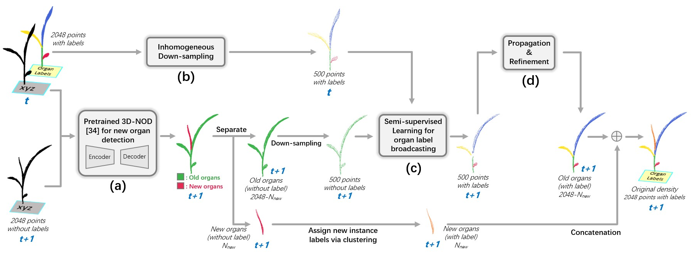
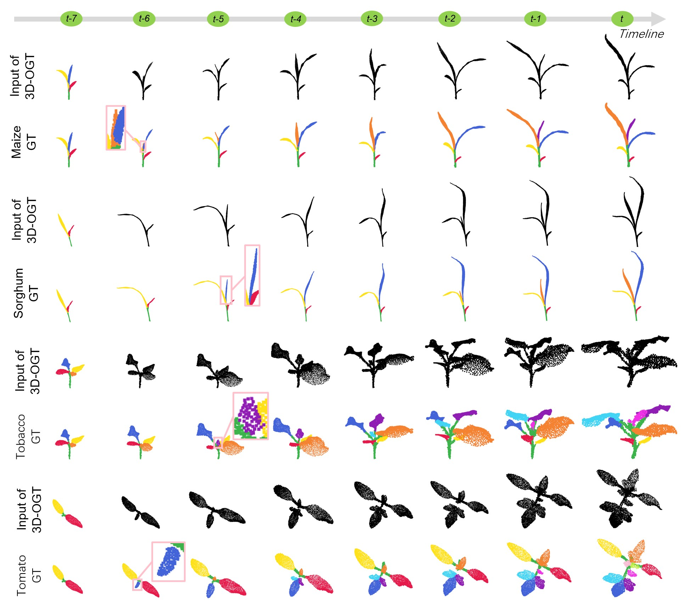

3D-OGT
=====
This repo contains the official data and code for our paper:

<strong>3D-OGT: 3D organ growth tracking with minimum segmentation.</strong> 
[D. Li†](https://davidleepp.github.io/), Z. Wang†, L. Liu, and M. Li* 
† Equal contribution 
'*' Corresponding author 
Published online on *Plant Phenomics* in 2026 
[[Paper](https://www.sciencedirect.com/science/article/pii/S264365152600018X)]
[[10-minute presentation](https://www.bilibili.com/video/BV12hkuB3EuH)]

Introduction
------
To monitor the growth and structural changes of crop organs, dynamic plant phenotyping based on time-series point clouds has become a cutting-edge research topic. However, existing organ tracking methods based on crop time-series point clouds either rely on complete organ instance segmentation results or lack real-time performance in capturing spatiotemporal correlations among organs. These limitations significantly hinder the development of dynamic crop phenotyping. 
 
3D-OGT is a framework capable of performing continuous organ tracking throughout the entire growth sequence with only the minimal segmentation information. Our framework can automatically propagate organ labels from the previous moment's crop point cloud to the subsequent point cloud, while completing organ segmentation and tracking on multiple crop growth sequences. The framework can recognize and track new organs, mature (old) organs, and even suddenly disappeared organs. Experimental results on a spatiotemporal point cloud dataset demonstrate that the 3D-OGT framework achieves satisfactory organ tracking performance. The main workflow of our 3D-OGT is shonw in Fig. 1.  
<table border="0">
  <tr>
    <td width="100%" align="center">
       
    </td>
  </tr>
</table>

  <strong><em>Fig. 1. The overall roadmap of 3D-OGT. Module (a) is the step for new-organ detection on plant point cloud based on a pre-trained 3D-NOD; module (b) is the inhomogeneous down-sampling; module (c) is the organ label broadcasting based on semi-supervised learning; (d) is the module that performs label propagation and refinement. </em></strong>

 
The point cloud dataset of crop growth in our project covers 4 species—maize, sorghum, tobacco, and tomato with a total of 43 time-series point cloud sequences. Each sequence records the 3D shapes of a plant over continuous growth, with a sampling interval of 1–2 days. Specifically, the maize crop data consists of 3 sequences with a total of 26 point cloud samples; sorghum species includes 12 sequences with a total of 82 sample point clouds; tobacco contains 8 sequences with a total of 58 samples; and tomato possesses 20 sequences with a total of 212 point clouds. In the experiment, all point clouds are preprocessed using Farthest Point Sampling (FPS) to reduce and unify the number of points to 2048. All maize samples and a part of tomato samples in the dataset are derived from the Pheno4D Dataset, while the remaining tomato samples, as well as the full sorghum and tobacco data originate from the PlantNet dataset. Fig. 2 visualizes the manually annotated GT for several growth sequences in the dataset. Only the point cloud at the first moment of each input sequence for 3D-OGT carries organ labels, and all subsequent point clouds are unlabeled. Additionally, new buds and leaves are assigned new labels during the human annotation. For example, new organs appear at t-6 moment of maize, t-5 moment of sorghum, t-5 moment of tobacco, and t-6 moment of tomato (highlighted in the pink box areas in Fig. 2).  
<table border="0">
  <tr>
    <td width="100%" align="center">
       
    </td>
  </tr>
</table>

  <strong><em>Fig. 2. Visualization of part of the dataset used for experiment. It shows four input point cloud sequences of 3D-OGT of four species, along with the corresponding GT of the organs for each sequence. Specifically, the 1st, 3rd, 5th, and 7th rows show four input sequences for four different species, respectively. In each input sequence, only the point cloud at the first moment carries organ labels, and all subsequent point clouds are unlabeled. The 2nd, 4th, 6th, and 8th rows show the manually annotated organ growth labels rendered in different colors, where each organ label has spatiotemporal consistency. </em></strong>

Prerequisites
------
In order to stably track all organs in a 4D crop growth sequence, we believe that detection of new organs and tracking of mature organs should have the same importance. In the standard mode, we use the 3D-NOD framework (a new organ detection method) as the pre-trained network to detect new organs first. For details on the specific implementation of new organ detection, please refer to https://github.com/zingersu/3D-New-Organ-Detection-in-Plant-Growth-from-Spatiotemporal-Point-Clouds. After separating new organs from mature/old organs, we carry out organ tracking. All codes run under pytorch, and the platform configurations are as follows: 
* The 3D-OGT framework runs under Windows 11 
* Current code execution environment: 
    * Python == 3.8.20 
    * Pytorch == 2.1.2 
    * CUDA == 12.1 
    * Pandas == 2.0.3 
    * Scikit-learn == 1.3.2 

Quick Start
------
This project contains six folders. 
folder <strong>[code]</strong> contains the complete implementation of the 3D-OGT framework. 
folder <strong>[norm_GT_fps]</strong> contains all point cloud files with complete and precise instance labels, serving as the foundation for calculating quantitative tracking metrics. 
folder <strong>[instance_new_organ(3D-NOD)]</strong> and folder <strong>[instance_old_organ(3D-NOD)]</strong> comprise the outputs of the 3D-NOD framework, which is uesd as a pre-trained network for detecting new organs. Then the complete plant point cloud is divided into two categories: new organs and old organs. 
folder <strong>[instance_new_organ(by human)]</strong> and folder <strong>[instance_old_organ(by human)]</strong> contain their manually curated counterparts, where human annotation replaces the pre-trained network in detecting new organs before dividing them into the same two categories. 
 
<strong>Note:</strong> When running the code, if standard_mode is True, it refers to the standard 3D-OGT using the pre-trained 3D-NOD network; conversely, if standard_mode is False, it represents the control group employing the fully manual new organ detection module. 

<strong><em>code</em></strong> 
The folder contains the specific implementation of the 3D-OGT framework, providing all the necessary scripts and modules required to run the organ growth tracking system. 
* file <strong>[1_train.py]</strong> is used to track organ growth throughout the entire crop point cloud sequence. 
* file <strong>[2_eval_label_reset.py]</strong> is used to reset the instance label corresponding to the new organ, avoiding the decline in quantitative tracking results due to missed detection of the new organ. 
* file <strong>[3_eval_iou_track.py]</strong> is used to calculate the Intersection over Union (IoU) between all ground-truth organ instance labels and all algorithm-predicted organ instance labels, forming an IoU matrix. Then for each ground-truth organ, we search for the corresponding organ label number, where the organ point set represented by the organ label number can yield the maximum IoU value with this ground-truth organ.  
* file <strong>[4_evaluation.py]</strong> is used to calculate the final quantitative tracking results for each plant variety. 
 
